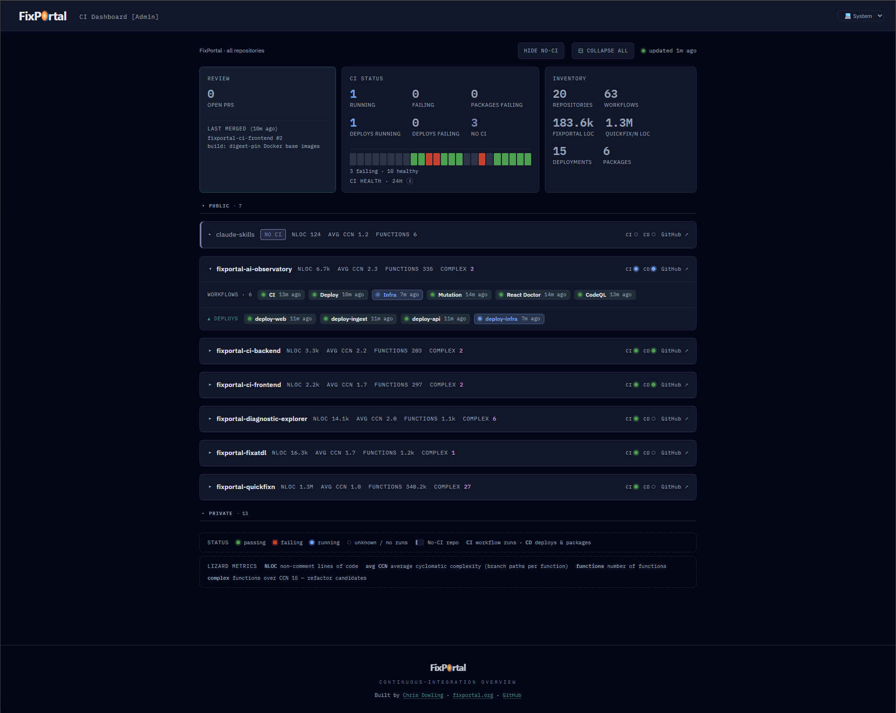

# fixportal-ci-frontend

> React CI dashboard — a component library and standalone app that render a GitHub organisation's
> CI overview (workflow status, open PRs, deploy lanes, per-repo metrics, 24-hour trend) from a
> single backend snapshot endpoint. No FixPortal-specific dependency required; brand and design
> tokens are injectable.



## What's in the repo

| Path | Contents |
|---|---|
| `packages/ci-frontend` | `@fix-portal/ci-frontend` — the publishable React component library |
| `apps/dashboard` | Thin Vite app that wires the library to a snapshot endpoint and serves it |

## Quick start — Docker (no install required)

The fastest path to a running dashboard. Only [Docker Desktop](https://www.docker.com/products/docker-desktop/) is needed.

```bash
docker run -p 8080:8080 -e BACKEND_URL=https://fixportal-ci-backend.happycoast-d46c800d.uksouth.azurecontainerapps.io ghcr.io/fixportal/fixportal-ci-frontend:latest
```

Open `http://localhost:8080`. The `BACKEND_URL` above is the FixPortal public backend; it serves
a read-only guest snapshot so you see real CI data without any further configuration.

To use your own backend, replace `BACKEND_URL` with your backend's origin (no trailing slash).
The dashboard proxies all `/api/` requests to that origin.

## Quick start — clone and run (dev mode)

```bash
git clone https://github.com/FixPortal/fixportal-ci-frontend.git
cd fixportal-ci-frontend
npm install
npm run dev
```

Builds the library and starts the app on `http://localhost:5173`. Point it at a backend by
copying `apps/dashboard/.env.example` to `apps/dashboard/.env` and setting `VITE_CI_API_BASE`
to your backend's origin.

## Self-hosting with Docker

Build the image from source and run it against your own backend:

```bash
git clone https://github.com/FixPortal/fixportal-ci-frontend.git
cd fixportal-ci-frontend
docker build -t ci-frontend .
docker run -p 8080:8080 -e BACKEND_URL=https://your-backend.example.com ci-frontend
```

> [!IMPORTANT]
> `BACKEND_URL` must be a bare origin — no trailing slash, no path
> (e.g. `https://your-backend.example.com`). A trailing slash causes nginx to strip the `/api/`
> prefix before forwarding, silently mangling upstream paths.

The image runs nginx on port **8080** (non-root; nginx cannot bind ports below 1024). Map
accordingly: `-p 80:8080` or `-p 443:8080` behind a TLS terminator.

## Using the library in your own app

```bash
npm install @fix-portal/ci-frontend @tanstack/react-query react react-dom
```

`react`, `react-dom`, and `@tanstack/react-query` are peer dependencies — the library uses your
copies, so wrap the board in your existing `QueryClientProvider`.

```tsx
import { QueryClient, QueryClientProvider } from '@tanstack/react-query'
import { CiBoard } from '@fix-portal/ci-frontend'

// If you have no design system of your own, import both stylesheets:
import '@fix-portal/ci-frontend/tokens.css'
import '@fix-portal/ci-frontend/board.css'

const queryClient = new QueryClient()

export function App() {
  return (
    <QueryClientProvider client={queryClient}>
      <CiBoard adminSignal={false} apiBase="https://ci.example.org" />
    </QueryClientProvider>
  )
}
```

### `CiBoard` props

| Prop | Type | Default | Purpose |
|---|---|---|---|
| `adminSignal` | `boolean` | required | `true` shows private repos and actionable PR links; `false` is the public read-only view. Derive from your app's auth state. |
| `apiBase` | `string` | `''` | Origin of the CI backend (no trailing slash). Empty string uses relative `/api/` URLs — correct when running behind a proxy. |
| `logo` | `ReactNode` | text wordmark | Brand mark rendered in the dashboard header. |
| `footerSlot` | `ReactNode` | generic footer | Footer content; pass your own to replace the default. |

### Styling

The board reads ~15 CSS custom properties (`--text`, `--border`, `--brand`, `--card-bg`,
`--font-sans`, ...).

| Scenario | What to import |
|---|---|
| No existing design system | `tokens.css` before `board.css` — vendored light/dark token set included |
| You already define those token names | `board.css` only — your tokens flow in automatically |

Toggle dark mode: `document.documentElement.dataset.theme = 'dark'`.

## Backend contract

The board fetches `GET {apiBase}/api/dashboard/snapshot` and expects a `DashboardSnapshot`
JSON object (type exported from the package). The endpoint must be anonymous and CORS-accessible.
`204 No Content` is the documented "no snapshot yet" state — the board renders a waiting message.
See `src/api/types.ts` for the full shape.

## Compatibility

| Peer dependency | Required version |
|---|---|
| `react` | `>=18` |
| `react-dom` | `>=18` |
| `@tanstack/react-query` | `>=5` |

The standalone Docker app and Vite dev server target Node 22 (see `Dockerfile`).

## Development

```bash
npm test            # Vitest unit suite (library)
npm run lint        # ESLint across the workspace
npm run build:lib   # tsup → ESM + .d.ts + CSS
npm run build:app   # type-check and build the standalone app
```

## Troubleshooting

| Symptom | Cause | Fix |
|---|---|---|
| nginx logs `502` + `peer closed connection in SSL handshake` | nginx resolves the HTTPS upstream hostname to an IP and connects without SNI, so the backend rejects the handshake | Pull `latest` or rebuild from source (fix: `proxy_ssl_server_name on` added 2026-06-20) |
| Dashboard shows "waiting for snapshot" indefinitely | Backend returned `204 No Content` — no snapshot has been generated yet | Wait for the backend's first scheduled CI run, or check backend logs |
| Container exits immediately: `Error: BACKEND_URL must be set` | `BACKEND_URL` env var was not passed to `docker run` | Add `-e BACKEND_URL=https://your-backend.example.com` to the run command |
| `/api/` requests return wrong paths or 404 | Trailing slash on `BACKEND_URL` causes nginx to strip the `/api/` prefix before forwarding | Remove the trailing slash from `BACKEND_URL` |
| Dev mode ignores your backend | `VITE_CI_API_BASE` not set in `apps/dashboard/.env` | Copy `.env.example` to `.env` and set `VITE_CI_API_BASE` to your backend's origin |

## Contributing

See [CONTRIBUTING.md](./CONTRIBUTING.md). Core conventions:

- PRs target `main`; merged via rebase-merge (no merge commits, no squash)
- Run `npm test` and `npm run lint` before pushing
- One logical change per PR

## Appendix

**npm package**

```bash
npm install @fix-portal/ci-frontend @tanstack/react-query react react-dom
```

Package registry: [`@fix-portal/ci-frontend` on npm](https://www.npmjs.com/package/@fix-portal/ci-frontend)

**Docker image**

```
ghcr.io/fixportal/fixportal-ci-frontend:latest
```

Registry: [GitHub Container Registry — fixportal-ci-frontend](https://github.com/FixPortal/fixportal-ci-frontend/pkgs/container/fixportal-ci-frontend)

**Public backend (guest / read-only)**

```
https://fixportal-ci-backend.happycoast-d46c800d.uksouth.azurecontainerapps.io
```

Endpoint: `GET /api/dashboard/snapshot` — anonymous, returns a read-only CI snapshot.

## License

[Apache-2.0](./LICENSE).
