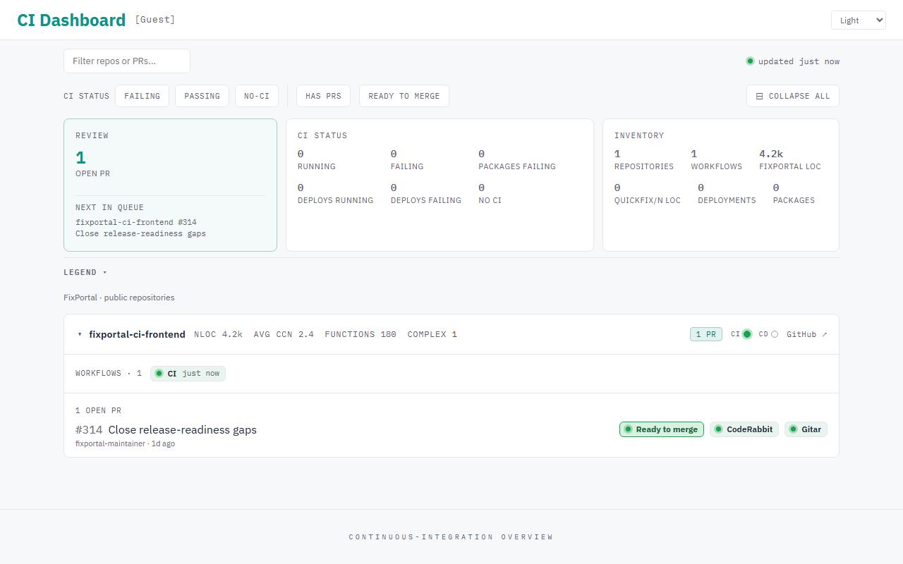

# fixportal-ci-frontend

> React CI dashboard — a component library and standalone app that render a GitHub organisation's
> CI overview (workflow status, open PRs, deploy lanes, per-repo metrics, 24-hour trend, per-PR
> review signals) from a single backend snapshot endpoint. No FixPortal-specific dependency
> required; brand and design tokens are injectable. Per-PR review signals appear only when the
> backend snapshot supplies `reviewSignals` on a pull request; older or unconfigured backends are
> rendered exactly as before.



> New here? [**The Neophyte's guide to setting up the CI dashboard**](docs/setup-guide.md)
> walks through every route from "just show me" to "point it at my own GitHub org",
> assuming no prior knowledge.

## What's in the repo

| Path | Contents |
|---|---|
| `packages/ci-frontend` | `@fix-portal/ci-frontend` — the publishable React component library |
| `apps/dashboard` | Thin Vite app that wires the library to a snapshot endpoint and serves it |

## Quick start — Docker (no install required)

The fastest path to a running dashboard. Only [Docker Desktop](https://www.docker.com/products/docker-desktop/) is needed.

```bash
docker run -p 8080:8080 -e BACKEND_URL=https://fixportal-ci-backend.happycoast-d46c800d.uksouth.azurecontainerapps.io ghcr.io/fixportal/fixportal-ci-frontend:latest
```

Open `http://localhost:8080`. The `BACKEND_URL` above is the FixPortal public backend; it serves
a read-only guest snapshot so you see real CI data without any further configuration.

To use your own backend, replace `BACKEND_URL` with your backend's origin (no trailing slash).
The dashboard proxies all `/api/` requests to that origin.

> [!TIP]
> **Want a dashboard of your own GitHub org or account?** This repo is display-only — the GitHub
> connection lives in the backend. The companion
> [`fixportal-ci-backend`](https://github.com/FixPortal/fixportal-ci-backend) repo's
> `docker compose up` brings up this board UI **and** a backend wired to your GitHub: set
> `GITHUB_TOKEN` and `GITHUB_OWNER` in its `.env` and it auto-discovers every repo. No further setup.

## Quick start — clone and run (dev mode)

Every dependency resolves from public npm, so this needs nothing but Node 22+ —
no tokens, no registry configuration, no FixPortal account.

```bash
git clone https://github.com/FixPortal/fixportal-ci-frontend.git
cd fixportal-ci-frontend
npm install
npm run dev
```

Builds the library and starts the app on `http://localhost:5173`. Point it at a backend by
copying `apps/dashboard/.env.example` to `apps/dashboard/.env` and setting `VITE_CI_API_BASE`
to your backend's origin.

Because the dev server origin (`http://localhost:5173`) differs from the backend's, the
browser calls the API cross-origin, so the backend must allow-list the dev origin or every
response is discarded. Run the backend with `Cors__AllowedOrigins__0=http://localhost:5173`
set (environment variable or `appsettings.Development.json`). The compose deployment does
not need this — nginx proxies `/api/` same-origin.

## Self-hosting with Docker

The published image needs no build at all (see the quick start above). Building the
image from source needs no credentials either:

```bash
git clone https://github.com/FixPortal/fixportal-ci-frontend.git
cd fixportal-ci-frontend
docker build -t ci-frontend .
docker run -p 8080:8080 -e BACKEND_URL=https://your-backend.example.com ci-frontend
```

> [!IMPORTANT]
> `BACKEND_URL` must be a bare origin — no trailing slash, no path
> (e.g. `https://your-backend.example.com`). A trailing slash causes nginx to strip the `/api/`
> prefix before forwarding, silently mangling upstream paths.

The image runs nginx on port **8080** (non-root; nginx cannot bind ports below 1024). Map
accordingly: `-p 80:8080` or `-p 443:8080` behind a TLS terminator.

> [!NOTE]
> The proxy forwards the **upstream's** hostname as the `Host` header (derived from
> `BACKEND_URL`), which is required for a correct TLS SNI handshake against an HTTPS backend.
> If your backend instead routes on the original client `Host` (name-based virtual hosting),
> it may reject the request — edit `nginx.conf.template` to `proxy_set_header Host $host;`,
> accepting that this disables SNI for HTTPS upstreams.

## Using the library in your own app

```bash
npm install @fix-portal/ci-frontend @tanstack/react-query react react-dom
```

`react`, `react-dom`, and `@tanstack/react-query` are required peer dependencies: your app
provides them, and the library does not bundle its own copies. If your app already has a
`QueryClientProvider`, the board reuses it; otherwise the board creates an internal client.

```tsx
import { QueryClient, QueryClientProvider } from '@tanstack/react-query'
import { CiBoard } from '@fix-portal/ci-frontend'

// If you have no design system of your own, import both stylesheets:
import '@fix-portal/ci-frontend/tokens.css'
import '@fix-portal/ci-frontend/board.css'

const queryClient = new QueryClient()

export function App() {
  return (
    <QueryClientProvider client={queryClient}>
      <CiBoard adminSignal={false} apiBase="https://ci.example.org" />
    </QueryClientProvider>
  )
}
```

### `CiBoard` props

| Prop | Type | Default | Purpose |
|---|---|---|---|
| `adminSignal` | `boolean` | required | Host-computed admin state. Private repos and admin-only controls appear only when this is `true` and an admin snapshot URL or fetcher is configured; safe links in the guest snapshot remain clickable. |
| `apiBase` | `string` | `''` | Origin of the CI backend (no trailing slash). Empty string uses relative `/api/` URLs — correct when running behind a proxy. |
| `snapshotFetcher` | `() => Promise<DashboardSnapshot \| null>` | plain fetch | Guest snapshot fetcher for hosts that must attach auth headers. |
| `snapshotCacheKey` | `string` | unset | Stable cache-key override for a custom guest fetcher. Distinct fetcher functions are isolated by default; set this to retain a row across recreated function identities. |
| `adminSnapshotUrl` | `string` | unset | Host proxy URL for the privileged snapshot. The host must add `X-Admin-Key` server-side; never expose that secret to the browser. |
| `adminSnapshotFetcher` | `() => Promise<DashboardSnapshot \| null>` | unset | Authenticated admin fetcher; takes precedence over `adminSnapshotUrl`. |
| `adminSnapshotCacheKey` | `string` | unset | Stable cache-key override for a custom admin fetcher; it has the same behavior as `snapshotCacheKey`. |
| `logo` | `ReactNode` | text wordmark | Brand mark rendered in the dashboard header. |
| `footerSlot` | `ReactNode` | generic footer | Footer content; pass your own to replace the default. |
| `storageNamespace` | `string` | unset | Suffix for local-storage keys and the skip-link target, preventing collisions between boards on one origin. |
| `repositoryScope` | `string` | unset | Canonical `owner/repository` identity that limits the board to one already-authorised repository. |
| `showThemeSwitcher` | `boolean` | `true` | Shows the board's Light / Dark / System selector. |

### Styling

The board reads ~15 CSS custom properties (`--text`, `--border`, `--brand`, `--card-bg`,
`--font-sans`, ...).

| Scenario | What to import |
|---|---|
| No existing design system | `tokens.css` before `board.css` — vendored light/dark token set included |
| You already define those token names | `board.css` only — your tokens flow in automatically |

The built-in Light / Dark / System selector applies `data-theme` to the board's own
`.ci-page` container, so it does not alter the host page. Hide it with
`showThemeSwitcher={false}` when the host supplies its own board-local theme control.

### TypeScript: CSS imports

If your bundler supplies ambient CSS module types (Vite does, via `vite/client`),
the two stylesheet imports type-check as-is. Without them TypeScript reports
`TS2882` on the side-effect imports; add a one-line declaration:

```ts
// css.d.ts
declare module '*.css'
```

### Testing a page that contains the board

`CiBoard` measures its own header and reads the user's colour-scheme preference,
so under jsdom — which implements neither API — it needs two stubs in your test
setup file. Without them the render throws `ResizeObserver is not defined`, then
`window.matchMedia is not a function`:

```ts
// vitest.setup.ts
class ResizeObserverStub {
  observe() {}
  unobserve() {}
  disconnect() {}
}
globalThis.ResizeObserver = ResizeObserverStub as unknown as typeof ResizeObserver

window.matchMedia = ((query: string) => ({
  matches: false,
  media: query,
  onchange: null,
  addListener() {},
  removeListener() {},
  addEventListener() {},
  removeEventListener() {},
  dispatchEvent: () => false,
})) as unknown as typeof window.matchMedia
```

Neither is needed in a real browser.

## Backend contract

The board fetches `GET {apiBase}/api/dashboard/snapshot` and expects a `DashboardSnapshot`
JSON object (type exported from the package). When the default fetch path calls a cross-origin
endpoint, it must be anonymous and CORS-accessible. A custom `snapshotFetcher` may authenticate
according to its own backend contract.
`204 No Content` is the documented "no snapshot yet" state — the board renders a waiting message.
See `src/api/types.ts` for the full shape.

## Compatibility

| Peer dependency | Required version |
|---|---|
| `react` | `>=18` |
| `react-dom` | `>=18` |
| `@tanstack/react-query` | `>=5` |

The standalone Docker app and Vite dev server target Node 22 (see `Dockerfile`).

## Development

```bash
npm test            # every workspace test script
npm run lint        # ESLint across the workspace
npm run build:lib   # tsup → ESM + .d.ts + CSS
npm run build:app   # type-check and build the standalone app
```

### Design token sync

The standalone token sheet is intentionally vendored so public clones do not
depend on the private `@fixportal/design` package. When the canonical design
tokens change, run the projection check from a checkout that also contains the
`fixportal-assets` repository:

```bash
npm run design:tokens:check -- --source=../fixportal-assets/packages/design/tokens.css
```

The check compares the universal tokens used by this board and allows only the
two documented frontend accessibility overrides. Update
`packages/ci-frontend/src/styles/tokens.css` deliberately, then rerun the check
and the normal verification suite.

## Troubleshooting

| Symptom | Cause | Fix |
|---|---|---|
| nginx logs `502` + `peer closed connection in SSL handshake` | nginx resolves the HTTPS upstream hostname to an IP and connects without SNI, so the backend rejects the handshake | Pull `latest` or rebuild from source (fix: `proxy_ssl_server_name on` added 2026-06-20) |
| Dashboard shows "waiting for snapshot" indefinitely | Backend returned `204 No Content` — no snapshot has been generated yet | Wait for the backend's first scheduled CI run, or check backend logs |
| Container exits immediately: `Error: BACKEND_URL must be set` | `BACKEND_URL` env var was not passed to `docker run` | Add `-e BACKEND_URL=https://your-backend.example.com` to the run command |
| `/api/` requests return wrong paths or 404 | Trailing slash on `BACKEND_URL` causes nginx to strip the `/api/` prefix before forwarding | Remove the trailing slash from `BACKEND_URL` |
| Dev mode ignores your backend | `VITE_CI_API_BASE` not set in `apps/dashboard/.env` | Copy `.env.example` to `.env` and set `VITE_CI_API_BASE` to your backend's origin |
| Dev mode sits at "Dashboard unavailable. Retrying automatically." | The backend's CORS allow-list has no entry for the dev origin, so the browser discards the (otherwise `200`) responses | Run the backend with `Cors__AllowedOrigins__0=http://localhost:5173` |
| Your tests throw `ResizeObserver is not defined` or `window.matchMedia is not a function` | jsdom implements neither API, and the board uses both | Add the two stubs from [Testing a page that contains the board](#testing-a-page-that-contains-the-board) |
| `TS2882` on the `board.css` / `tokens.css` imports | Your TypeScript setup has no ambient declaration for CSS modules | Add `declare module '*.css'` — see [TypeScript: CSS imports](#typescript-css-imports) |

## Contributing

See [CONTRIBUTING.md](./CONTRIBUTING.md). Core conventions:

- PRs target `main`; merged via rebase-merge (no merge commits, no squash)
- Run `npm test` and `npm run lint` before pushing
- One logical change per PR

Notable changes are recorded in [CHANGELOG.md](CHANGELOG.md).

## Appendix

### npm package

```bash
npm install @fix-portal/ci-frontend @tanstack/react-query react react-dom
```

Package registry: [`@fix-portal/ci-frontend` on npm](https://www.npmjs.com/package/@fix-portal/ci-frontend)

### Docker image

```
ghcr.io/fixportal/fixportal-ci-frontend:latest
```

Registry: [GitHub Container Registry — fixportal-ci-frontend](https://github.com/FixPortal/fixportal-ci-frontend/pkgs/container/fixportal-ci-frontend)

### Public backend (guest / read-only)

```
https://fixportal-ci-backend.happycoast-d46c800d.uksouth.azurecontainerapps.io
```

Endpoint: `GET /api/dashboard/snapshot` — anonymous, returns a read-only CI snapshot.

## License

[Apache-2.0](./LICENSE).
